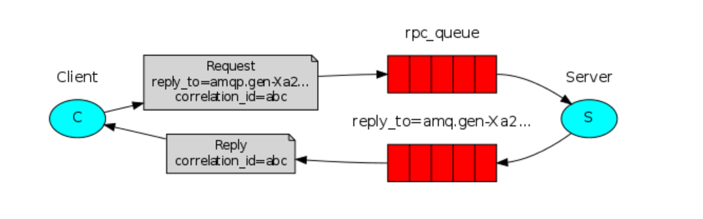

# Overview

This document is a summary of how the entire project was carried out. It includes the project's objectives, the methodology used, the results obtained and the conclusions drawn from the results. 

1. [Asp .Net core server](

2. [Python server](

3. [RabbitMq Broker](#rabbitmq-broker)

# RabbitMq Broker

[RabbitMq](https://www.rabbitmq.com/documentation.html) is a Message Broker that implements the Advanced Message Queuing Protocol (AMQP). It is used to send and receive messages between applications and its role inside this project is to deliver messages exchanged between Asp .Net core and Python servers.

Listens on port **15672** where it's also available a web interface to monitor queues and messages, click this [link](http://localhost:15672) to check if Rabbit is up and running on your local machine.

The following image shows the queues and messages exchanged between the two servers:

